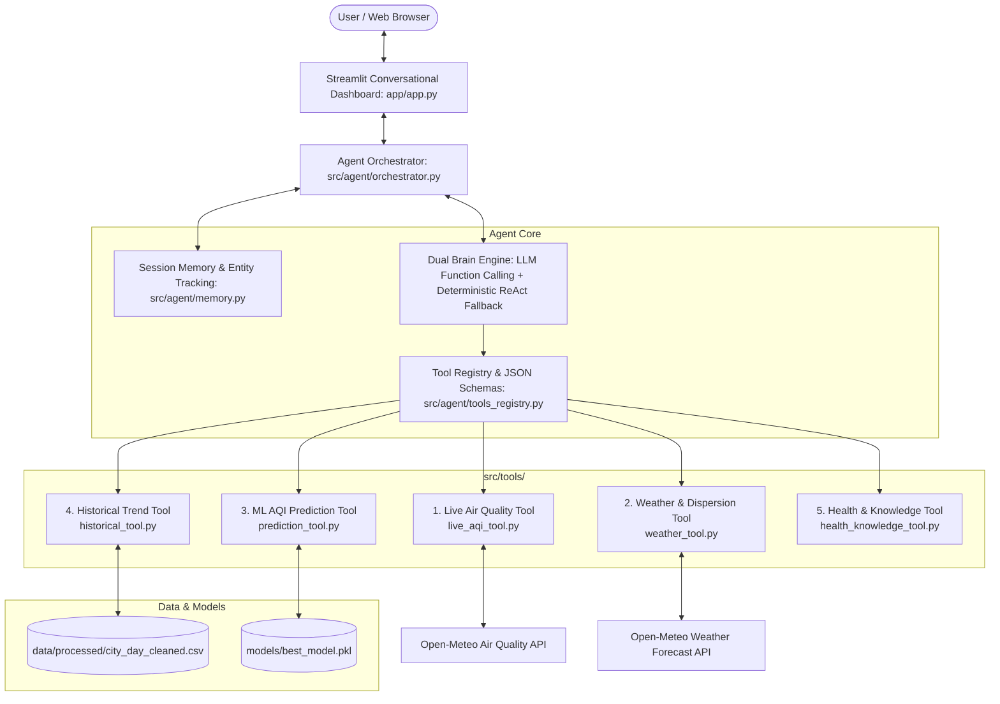

# 🌍 Air Quality Intelligence Agent

[](https://www.python.org/downloads/)
[](https://streamlit.io/)
[](https://scikit-learn.org/)
[](LICENSE)

> An autonomous, context-aware AI Agent for real-time atmospheric intelligence, ML-based air quality forecasting, and CPCB/WHO health risk advisories.

---

## 📌 Project Overview

Traditional air quality prediction applications operate as static, passive calculators: they require users to manually input concentrations of 12 chemical pollutants (such as benzene, toluene, or nitric oxide in parts-per-billion) and compute a single number.

The **Air Quality Intelligence Agent** elevates this project into an autonomous, tool-using assistant. It understands natural-language questions, dynamically decides which external APIs and models to query, inspects weather dispersion patterns, assesses historical multi-year trends, evaluates health risk criteria, and responds with actionable insights and conversational memory.

---

## 🚀 Why This Is an AI Agent (Not Just a Predictor)

| Capability | Traditional ML Predictor | Air Quality Intelligence Agent |
| :--- | :--- | :--- |
| **Interaction** | Rigid form with 15 numerical input boxes | Natural-language dialogue interface with multi-turn memory |
| **Data Source** | Static CSV files or hardcoded values | Live, dynamic sensor APIs (Open-Meteo, OpenAQ) + Historical dataset |
| **Tool Calling** | None (Single forward pass) | Autonomous decision loop choosing between 5 specialized tools |
| **Situational Awareness** | Ignores weather dynamics | Evaluates temperature, humidity, wind velocity, and thermal stagnation |
| **Contextual Memory** | Stateless | Retains active city and user health vulnerabilities (e.g. Asthma) |
| **Health Guidance** | Static label (e.g. "Moderate") | Evidence-based CPCB & WHO advisories tailored to activity and physiology |

---

## 🏗️ System Architecture



---

## 🔄 Agent Execution Lifecycle (ReAct Pattern)

1. **Goal & Intent Perception:** The agent analyzes the user prompt (e.g., *"Should I go for a morning run in Delhi tomorrow?"*) and resolves entities (City: `Delhi`, Activity: `Running`, Target Time: `Tomorrow`).
2. **Context Resolution:** If the city is omitted in subsequent turns (e.g., *"Why is it so poor?"*), the session memory supplies `Delhi` from context.
3. **Multi-Tool Orchestration:**
   * Calls `fetch_live_air_quality("Delhi")` to retrieve current sensor readings.
   * Calls `fetch_weather_forecast("Delhi", "tomorrow")` to analyze wind speed and inversion risk.
   * Calls `predict_aqi_tool("Delhi", "tomorrow")` to run the Random Forest model with current baseline inputs.
   * Calls `get_aqi_health_guidance(aqi, activity="running")` for medical safety recommendations.
4. **Contextual Synthesis:** Merges observations into a structured intelligence report with transparency traces.

---

## 🛠️ The 5 Specialized Tools

### 1. Live Air Quality Tool (`src/tools/live_aqi_tool.py`)
* Queries real-time monitoring stations via Open-Meteo Air Quality API (with built-in geocoding and fallback city coordinates).
* Retrieves concentrations for `PM2.5`, `PM10`, `NO2`, `SO2`, `CO`, `O3`, US AQI, and European AQI.
* Automatically identifies the **primary driving pollutant** and ratio relative to safe thresholds.

### 2. Weather & Dispersion Tool (`src/tools/weather_tool.py`)
* Retrieves temperature, relative humidity, wind velocity, and precipitation.
* Computes an **Atmospheric Ventilation Index**: detects when low wind speed (< 6 km/h) combined with high humidity (> 75%) traps pollutants close to the ground, or when rainfall provides atmospheric scrubbing.

### 3. Machine Learning Prediction Tool (`src/tools/prediction_tool.py`)
* Wraps the trained **Random Forest Regression Pipeline** (`models/best_model.pkl`).
* Capable of predicting AQI for future dates using live city baselines or evaluating custom scenario payloads.
* Returns scalar AQI, CPCB category, confidence metrics, and top factor contributions.

### 4. Historical Trend Tool (`src/tools/historical_tool.py`)
* Queries multi-year records (2015–2020) from `city_day_cleaned.csv`.
* Computes city averages, min/max distributions, seasonal variations (Winter vs. Monsoon vs. Summer), and percentile ranks.
* Benchmarks current AQI against multi-year regional norms.

### 5. AQI Health & Knowledge Tool (`src/tools/health_knowledge_tool.py`)
* Authoritative guidance based on **Central Pollution Control Board (CPCB)** and **World Health Organization (WHO 2021)** standards.
* Tailors recommendations for high-risk demographics (asthma, COPD, cardiovascular illness, elderly, children) and specific outdoor sports.

---

## 🧪 Machine Learning Pipeline & Data Science Improvements

The original pipeline was refactored to resolve key data science issues:

* **Fixed Target Imputation Leakage:** In earlier iterations, missing target labels were filled with the dataset mean. In `src/ml/train_pipeline.py`, rows missing `AQI` are cleanly dropped rather than fabricating synthetic labels.
* **Eliminated Pre-Split Data Leakage:** Preprocessing was bundled into an `sklearn.pipeline.Pipeline([('imputer', SimpleImputer(strategy='mean')), ('regressor', RandomForestRegressor(...))])`, ensuring imputers are fitted strictly on training folds.
* **Model Serialization:** Resolved `.gitignore` conflicts and saved the production pipeline to `models/best_model.pkl` with full test validation.

### Evaluation Benchmark

| Model | MAE | RMSE | $R^2$ Score | Status |
| :--- | :---: | :---: | :---: | :--- |
| **Linear Regression** | 31.68 | 60.68 | 0.7639 | Baseline |
| **Decision Tree** | 27.96 | 59.36 | 0.7740 | Baseline |
| **Random Forest Pipeline (Cleaned)** | **20.79** | **40.57** | **0.9101** | **Active Production Pipeline** |

---

## 📂 Project Structure

```text
Air-AQI-Prediction/
├── app/
│   └── app.py                     # Streamlit Conversational Dashboard
├── data/
│   ├── raw/
│   │   └── city_day.csv           # Raw historical Kaggle dataset
│   └── processed/
│       └── city_day_cleaned.csv   # Cleaned multi-city dataset
├── models/
│   ├── best_model.pkl             # Production Random Forest Pipeline
│   └── linear_regression_model.pkl# Fallback Linear Regression artifact
├── notebook/
│   └── aqi_pipeline.ipynb         # Exploratory Data Analysis & experiments
├── src/
│   ├── agent/
│   │   ├── memory.py              # Conversational session & entity buffer
│   │   ├── tools_registry.py      # OpenAI tool schemas & dispatcher
│   │   └── orchestrator.py        # Core Agent brain (LLM + ReAct fallback)
│   ├── ml/
│   │   └── train_pipeline.py      # Clean ML training and evaluation script
│   ├── tools/
│   │   ├── live_aqi_tool.py       # Live air quality fetcher
│   │   ├── weather_tool.py        # Weather forecast & dispersion index
│   │   ├── prediction_tool.py     # ML prediction tool wrapper
│   │   ├── historical_tool.py     # Historical trends & comparisons
│   │   └── health_knowledge_tool.py # CPCB & WHO health advisories
│   ├── aqi_utils.py               # AQI standards, categories, and colors
│   └── predictor.py               # Low-level model inference and feature prep
├── tests/
│   ├── test_prediction.py         # ML model unit tests
│   ├── test_tools.py              # Unit tests for all 5 intelligence tools
│   └── test_agent.py              # Agent orchestration & memory tests
├── .env.example                   # Environment configuration template
├── requirements.txt               # Minimal production dependencies
└── README.md                      # Documentation & architecture guide
```

---

## ⚡ Quickstart & Installation

### 1. Clone the Repository
```bash
git clone https://github.com/nikunjdixit-ai/-Air-AQI-Prediction.git
cd -Air-AQI-Prediction
```

### 2. Install Dependencies
```bash
pip install -r requirements.txt
```

### 3. (Optional) Configure Environment Variables
Copy `.env.example` to `.env` if you want to use OpenAI or Gemini for LLM function calling:
```bash
cp .env.example .env
```
> **Zero-Configuration Guarantee:** You do **not** need an API key to test the agent. If no key is set, the system automatically uses the built-in **Deterministic ReAct Engine** with full access to live weather, live AQI, the ML model, and historical data!

### 4. Run the Test Suite
```bash
python -m unittest discover -s tests -p "test_*.py"
```

### 5. Launch the Application
```bash
streamlit run app/app.py
```

---

## 💬 Example Queries & Agent Activity Traces

### Scenario 1: Live Real-Time AQI
* **User:** *"What is the AQI in Kanpur today?"*
* **Agent Activity:**
  - `📍 Location identified: Kanpur`
  - `📡 Calling fetch_live_air_quality for Kanpur`
  - `🩺 Calling get_aqi_health_guidance for evaluated AQI`
* **Response:** Returns Kanpur's real-time AQI, category badge, dominant pollutant breakdown, and CPCB advisory.

### Scenario 2: Multi-Tool Activity Planning
* **User:** *"Should I go for a morning run in Delhi tomorrow?"*
* **Agent Activity:**
  - `📍 Location identified: Delhi`
  - `📡 Calling fetch_live_air_quality for Delhi`
  - `⛅ Calling fetch_weather_forecast for Delhi`
  - `🤖 Calling predict_aqi_tool (Random Forest Pipeline) for Delhi tomorrow`
  - `🩺 Calling get_aqi_health_guidance for evaluated AQI and activity 'running'`
* **Response:** Synthesizes weather conditions, predicted AQI, ventilation stagnation risk, and a clear safety advisory.

### Scenario 3: Causal Analysis & Driver Pollutants
* **User:** *"Why is the air quality poor today?"*
* **Agent Activity:**
  - `📡 Retrieved live atmospheric metrics`
  - `⛅ Analyzed atmospheric dispersion (wind velocity & humidity)`
  - `🔍 Computed pollutant ratios against national standards`
* **Response:** Explains whether particulates (PM2.5/PM10) or photochemical smog (O3/NO2) are driving the index, coupled with meteorological trapping effects.

### Scenario 4: Historical Comparison
* **User:** *"Compare today's AQI with the historical trend."*
* **Agent Activity:**
  - `📊 Queried city_day_cleaned.csv historical database`
  - `📈 Calculated percentile rank against 5-year multi-season baseline`
* **Response:** Contextualizes whether today's air quality is cleaner or more severe than the seasonal average.

### Scenario 5: Multi-Turn Conversational Memory
* **Turn 1 User:** *"I live in Kanpur."*
* **Turn 2 User:** *"Should I exercise outside tomorrow?"*
* **Agent Action:** Automatically recalls Kanpur from session memory without asking the user to repeat their location.

---

## ⚖️ Limitations & Future Improvements

* **Temporal Forecasting Horizon:** The current ML model utilizes daily temporal components and pollutant baselines. Incorporating multi-step autoregressive models (e.g. Prophet or TimesNet) would improve multi-day forecasts.
* **Hyper-Local Sensors:** Expanding beyond city-level reference monitors to localized IoT sensor grids (e.g. PurpleAir) would enable neighborhood-level granularity.
* **Proactive Push Alerts:** An autonomous background daemon (via APScheduler or Webhooks) could proactively notify users when sudden AQI spikes occur.

---

## 📜 License

This project is licensed under the MIT License.
